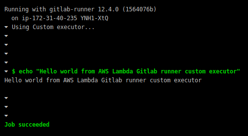

# gitlab-runner-lambda-executor



This project contains explanation and code snippets to use AWS lambda function as a custom Gitlab runner executor.

## Lambda configuration

The following documentation has been tested with **Python version 3.7** for both the local environment and the Lambda function.

The commands have to be executed into your own copy of this project.

### Lambda configuration

Create a new Python3.7 lambda function from the AWS console.

Choose the option of creating a new role for your function from policy templates.

In order to use Git, add a [Git layer](https://github.com/lambci/git-lambda-layer) to your lambda.

Set the following environment variables for the lambda function:
 * `GITLAB_URL` with your Gitlab URL (for instance: `gitlab.your-domain.com`),
 * `ACCESS_TOKEN` with your Gitlab access token (**Access token** into Gitlab user settings)

Set the lambda main handler as **main.__main__**.

### Make the Python virtual environment

Create a local virtual env to store all your Lambda dependencies.

```sh
python3 -m venv .
```

Enable it.

```sh
source venv/bin/activate
```

### Install the lambda dependencies

The `requirements.txt` file contains required dependencies for the Lambda to run.

Append your own dependencies into that file.

Install them into your local virtual env with:

```sh
pip3 install -r requirements.txt
```

You can call dependencies executable script from your Gitlab-CI yaml this way:

```yaml
 - python /var/task/dependency-script.py .
```

### Archive the lambda

Create an archive of the lambda:

```sh
cd lib/python3.7/site-packages && \
    zip -r9 ../../../lambda.zip . && \
    cd ../../../ && \
    zip -g lambda.zip main.py
```

Upload your lambda code as a ZIP file on the AWS console.

## Gitlab runner configuration

The following commands have to be executed on your Gitlab runner instance.

### Setup the executor

Upload `executor.py` and `executor.sh` to your Gitlab runner instance.

Into `executor.py`, replace `LAMBDA_ARN` by your own lambda ARN.

Ensure **Python3+** is installed.

Ensure `boto3` is installed:

```sh
pip3 install boto3
```

Ensure AWS credentials are set correctly into `~/.aws/credentials`:

```sh
[default]
aws_access_key_id = YOUR_ACCESS_KEY
aws_secret_access_key = YOUR_SECRET_ACCESS_KEY
```

The user must have IAM privileges to invoke your Lambda function.

### Register the Gitlab runner

```sh
sudo gitlab-runner register \
    --non-interactive \
    --url YOUR_GITLAB_URL \
    --registration-token GITLAB_RUNNER_REGISTRATION_TOKEN \
    --executor custom \
    --custom-run-exec=executor.sh \
    --builds-dir=/tmp/builds \
    --cache-dir=/tmp/cache
```
